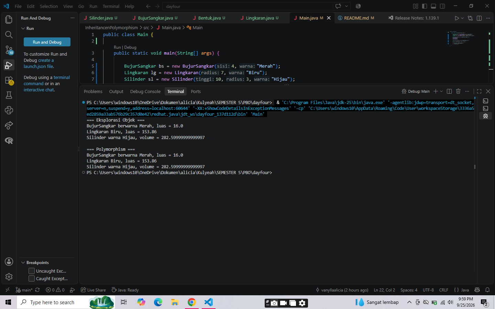

# Latihan Inheritance dan Polymorphism Java

Repository ini berisi latihan mengenai konsep **Encapsulation, Inheritance, dan Polymorphism** dalam Java.

## Struktur Class

Kucing (Superclass)
    └── Jinak (Subclass)
            ├── Anggora
            └── Persia

## Konsep yang Digunakan

### 1. Encapsulation

- Atribut `nama` dan `umur` pada class `Kucing` dibuat `private`.
- Akses dilakukan melalui `getter` dan `setter`.

### Screenshot Output

